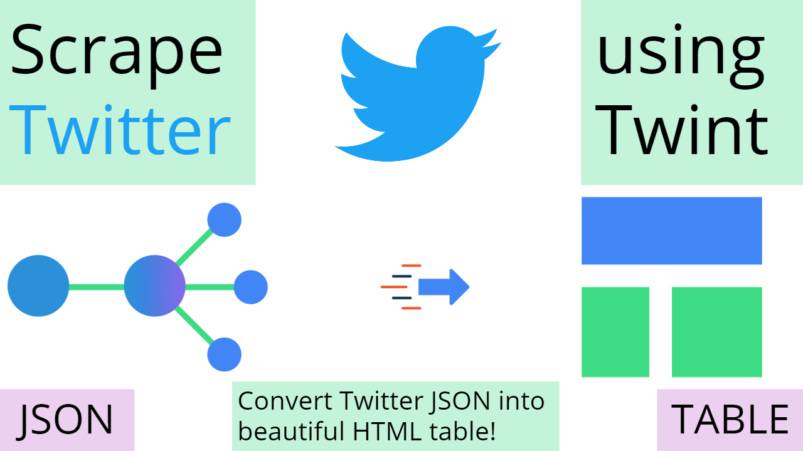

<h1 align="center">Scrape Twitter JSON to HTML Table</h1></br>

<p align="center">
This script shows how to scrape your tweets by date or year using the opensource project Twint and turn it into a beautiful HTML table. No API key is required..
</p>
<br>

<p align="center">
Twint: https://github.com/twintproject/twint
</p>
<p align="center">
json2html: https://github.com/softvar/json2html
</p>
<br>

<p align="center">
Video Usage Instructions on Awesome Dev Notes YouTube: https://youtu.be/042-QIhC5ms
</p>


<br>

<p align="center">
  <a href="#"></a>
  <a href="https://github.com/androiddevnotes"></a>

</p>

<br>
<p align="center">
</img>
</p><br>


filter.py: To filter out the JSON nodes. You can modify the script to remove the JSON data that is not required or add the ones you need.

jsonhtml.py: To convert the JSON data to HTML table. You don't need to modify this script to work.


<br>

## Installing Twint

Make sure you have python and pip installed.
```
pip3 install --user --upgrade git+https://github.com/twintproject/twint.git@origin/master#egg=twint
```

## Run Twint

Parameters are explained in the video or go to [wiki](https://github.com/twintproject/twint/wiki)

```
twint -u androiddevnotes --since 2020-05-20 --until 2021-03-01 -o twint_androiddevnotes.json --json
```

The output will be JSON data.


## Watch the [Video]() to see how to turn the above scraped Twitter JSON data to HTML table.

The video shows the usage of filter.py and jsonhtml.py

<br>

## :computer: Find us on

<div align="center">
	<a href="https://github.com/androiddevnotes"> GitHub </a> / <a href="https://discord.gg/vBnEhuC"> Discord </a> / <a href="https://twitter.com/androiddevnotes"> Twitter </a> / <a href="https://www.instagram.com/androiddevnotes"> Instagram </a> / <a href="https://www.youtube.com/channel/UCQATLaT0xKkSm-KKVQzpu0Q"> YouTube </a> / <a href="https://medium.com/@androiddevnotes"> Medium </a>
	<br><br>
    </img>
</div>